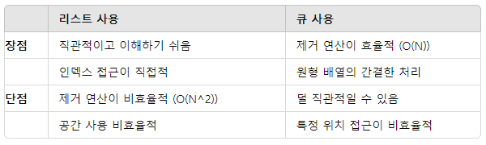

## 요세푸스 문제
원형으로 배열된 사람들 중에서 특정 간격마다 사람을 제거하는 문제
사진 출처 https://wikidocs.net/192533

### 리스트의 인덱스로 풀기

1. 문제의 설정:

- n명의 사람들이 원형으로 배열되어 있습니다.
- k번째 사람마다 제거를 반복합니다.
- 마지막에 남는 한 명을 찾는 것이 목표입니다.

2. 순환 구조:

- 원형 배열이기 때문에 끝에서 시작으로 다시 돌아갑니다. 즉, 인덱스가 리스트의 길이를 초과하면 처음으로 돌아옵니다.

3. 문제 해결의 단계:

- 초기화: n개의 원소를 가지는 리스트를 만들어 각 사람을 표시합니다.
- 반복: n-1명의 사람이 제거될 때까지 반복합니다.
- 인덱스 이동: k번째 사람을 찾기 위해 현재 인덱스에서 k-1번 이동합니다.
- 제거: k번째 사람을 리스트에서 제거(또는 표시)합니다.
- 출력: 마지막 남은 사람의 위치를 출력합니다.

4. 코드 설명:

##### 초기화:

- people 리스트에 1부터 N까지 숫자를 추가하여 초기화합니다. 이 리스트는 원형 배열에서 제거될 사람들을 나타냅니다.

##### 인덱스 계산 및 제거:

- index 변수를 사용하여 현재 위치를 추적합니다.
index = (index + K - 1) % people.size();를 사용하여 원형 배열에서 K번째 사람을 찾습니다. 나머지 연산을 사용하여 인덱스를 순환시킵니다.
res.add(people.remove(index));로 K번째 사람을 제거하고 결과 리스트에 추가합니다.

##### 마지막 남은 사람 추가:

- 반복이 끝난 후 people 리스트에 남은 마지막 사람을 결과 리스트에 추가합니다.

##### 입력 및 출력:

- BufferedReader와 StringTokenizer를 사용하여 입력을 받고, josephusList 메서드를 호출하여 결과를 출력합니다.

5. 코드 리뷰:

- 메서드를 static으로 선언하는 이유는 여러 가지가 있습니다. 주로 아래와 같은 이유들이 있습니다:

##### 인스턴스 생성 없이 호출 가능:

- static 메서드는 클래스 레벨에서 호출되므로, 객체를 생성하지 않고도 사용할 수 있습니다. 이는 특히 main 메서드와 같이 프로그램 시작 시점에 호출되어야 하는 메서드에서 유용합니다.

##### 독립적 실행:

- static 메서드는 특정 객체 상태와 무관하게 동작할 수 있도록 독립적으로 실행됩니다. 이는 주로 유틸리티 성격의 메서드에서 많이 사용됩니다.

##### 메모리 절약:

- static 메서드는 클래스 로딩 시점에 메모리에 할당되므로, 여러 객체가 공유할 수 있어 메모리를 절약할 수 있습니다. 하지만 이는 주로 메서드가 상태를 가지지 않는 경우에 해당합니다.
해당 예제에서는 main 메서드에서 josephusList 메서드를 호출해야 하므로, josephusList를 static으로 선언하면 객체 생성 없이 직접 호출할 수 있습니다.

  

### 큐를 이용하여 풀기

1. 문제의 설정:

- n명의 사람들이 원형으로 배열되어 있습니다.
- k번째 사람마다 제거를 반복합니다.
- 마지막에 남는 한 명을 찾는 것이 목표입니다.

2. 큐의 사용:

- 큐는 FIFO(First In, First Out) 자료구조로, 맨 앞의 원소를 제거하고 맨 뒤에 추가하는 연산을 반복하여 원형 배열을 시뮬레이션할 수 있습니다.

## 큐와 리스트 코드 비교

- <b>큐</b>를 사용하자!